# Screenshots - Quiz 02 (p229021 - Uzair Ahmad)

Yeh file tamam pages aur features ke screenshots par mushtamil hai. Har screenshot ke sath uska Roman Urdu mein wazahat di gayi hai.

---

## 1. Registration Page (Khaali Form)

Jab user pehli dafa website kholay to yeh registration form dikhta hai. Yahan user apna naam, email aur password darj kar sakta hai.

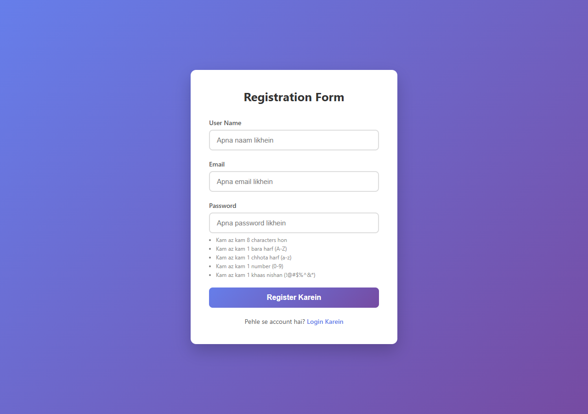

---

## 2. Password Validation - Kamzor Password

Jab user kamzor password likhay to real-time mein requirements laal rang mein dikhti hain. Yahan "abc" likha gaya hai jo tamam zarooraton ko poora nahi karta.

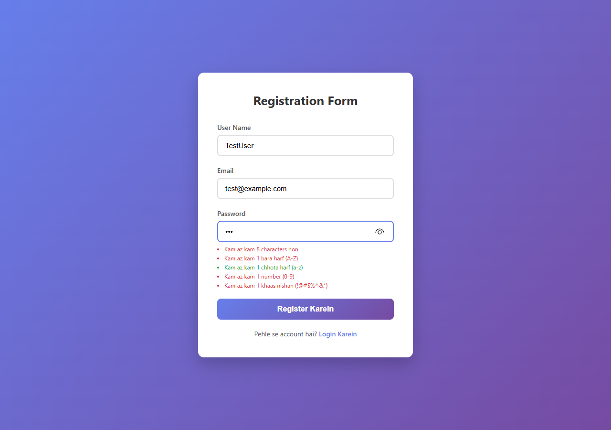

---

## 3. Password Validation - Mazboot Password

Jab password tamam zarooraton ko poora kare to requirements sabz (green) ho jati hain. Yahan "Test@1234" likha gaya hai jo tamam 5 zarooraton ko poora karta hai.

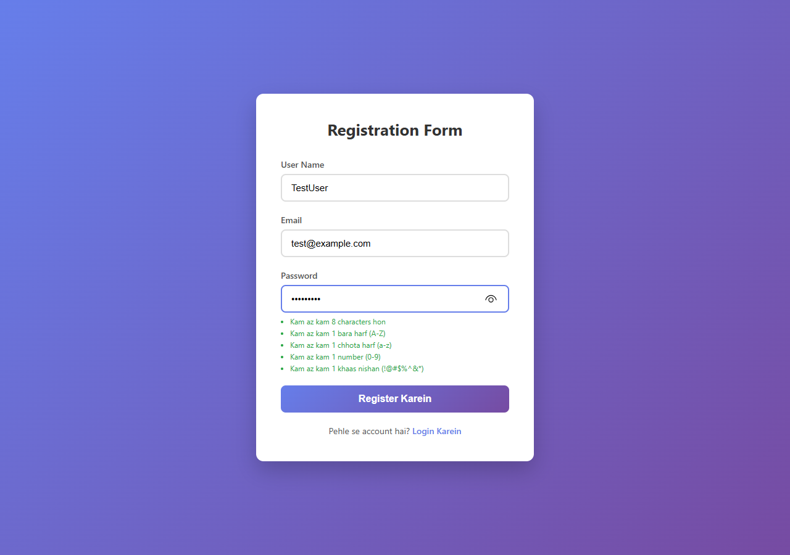

---

## 4. Form Validation Error

Agar user bina sahih maloomat ke form submit kare to client-side validation ghalti dikhata hai. Yahan password ki zarooraat poori nahi hui.

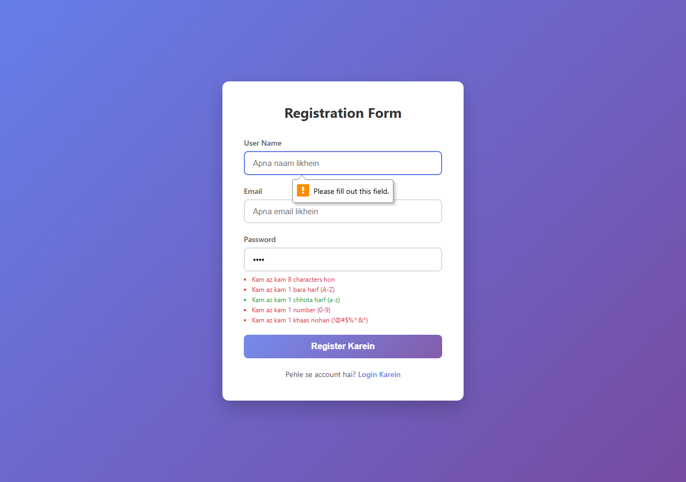

---

## 5. Kamyab Registration

Jab user sahih maloomat ke sath register kare to yeh kamyabi ka paigham dikhta hai. User ka naam aur email dikhai deta hai aur "Ab Login Karein" ka button milta hai.

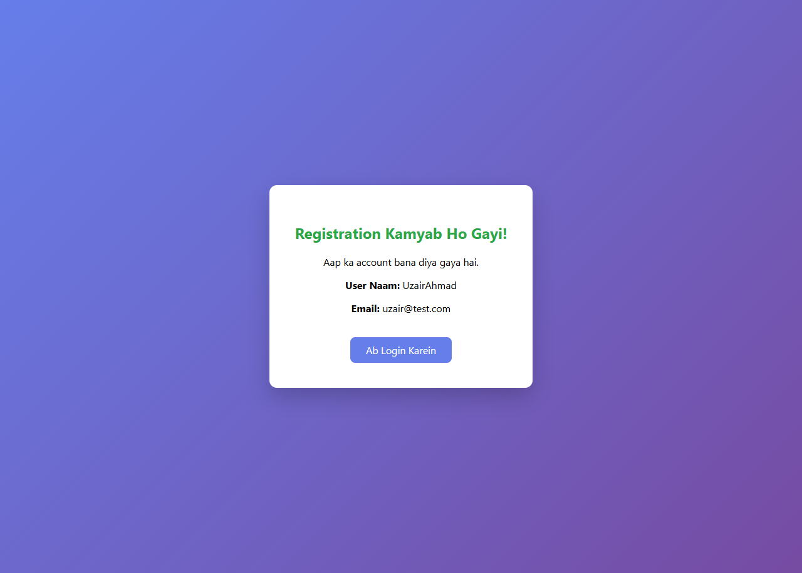

---

## 6. Duplicate Email Error

Agar koi usi email se dubara register karne ki koshish kare to yeh ghalti ka paigham dikhta hai. Ek email se sirf ek baar registration ho sakti hai.

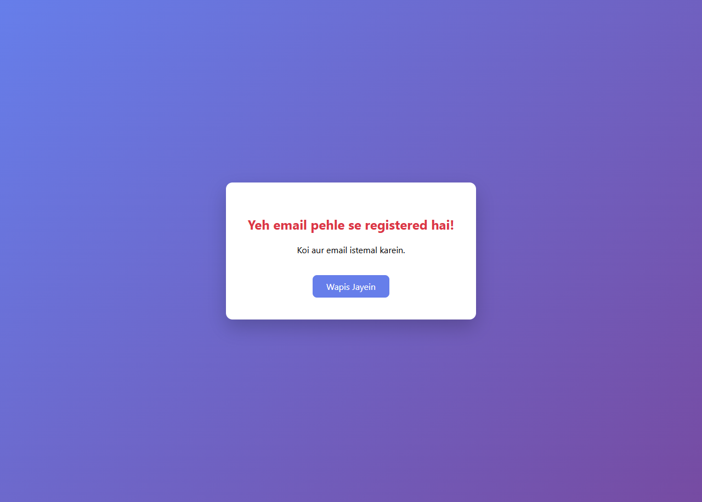

---

## 7. Login Page

Yeh login page hai jahan pehle se registered user apna email aur password darj karke login kar sakta hai. Neeche "Register Karein" ka link bhi hai.

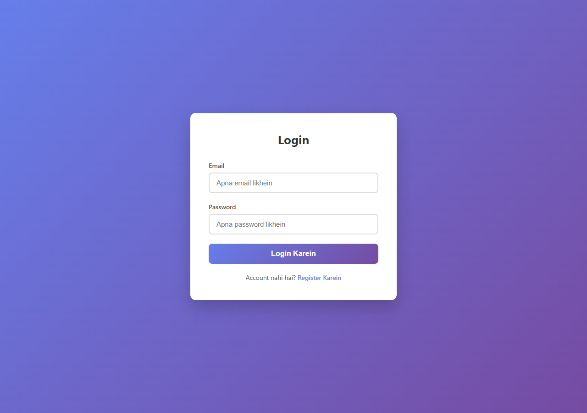

---

## 8. Login Nakaam (Ghalat Password)

Agar user ghalat email ya password darj kare to "Login Nakaam" ka paigham dikhta hai. User ko dobara koshish karne ya register karne ka option milta hai.

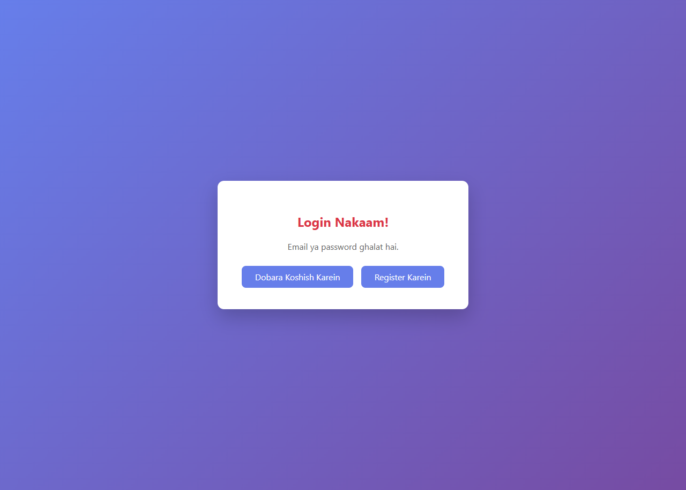

---

## 9. Landing Page - Hero Section

Kamyab login ke baad user is landing page par pahunchta hai. Hero section mein Uzair Ahmad ki tasveer (uzair.png) aur project ka taaruf dikhta hai. Navbar mein user ka naam aur logout button hai.

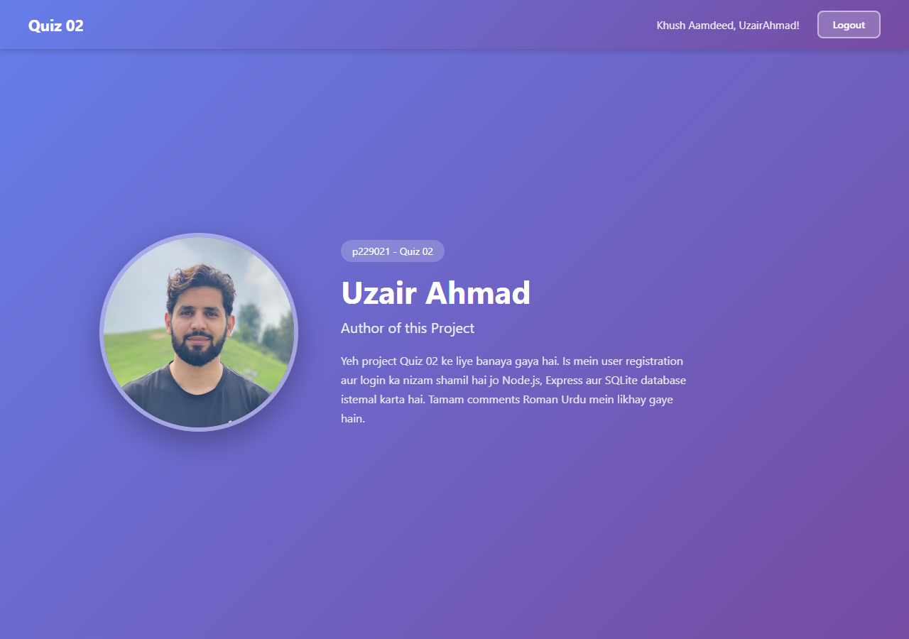

---

## 10. Landing Page - Full Page

Yeh landing page ka mukammal nazara hai jismein hero section aur assignment details dono shamil hain.

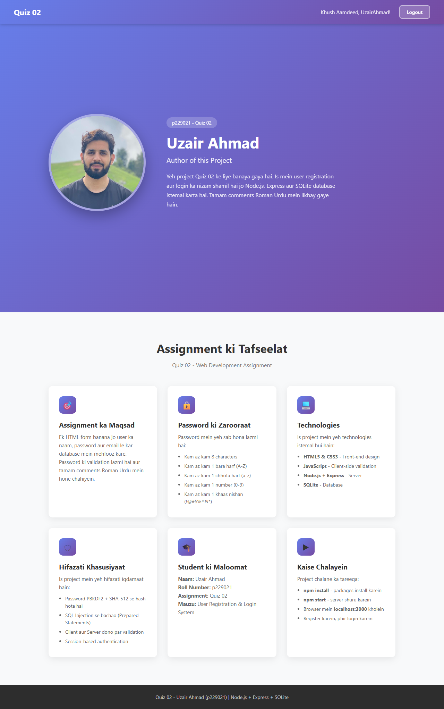

---

## 11. Assignment Details Section

Yeh section assignment ki tafseelat dikhata hai - 6 cards mein: assignment ka maqsad, password ki zarooraat, technologies, hifazati khasusiyaat, student ki maloomat, aur project chalane ka tareeqa.

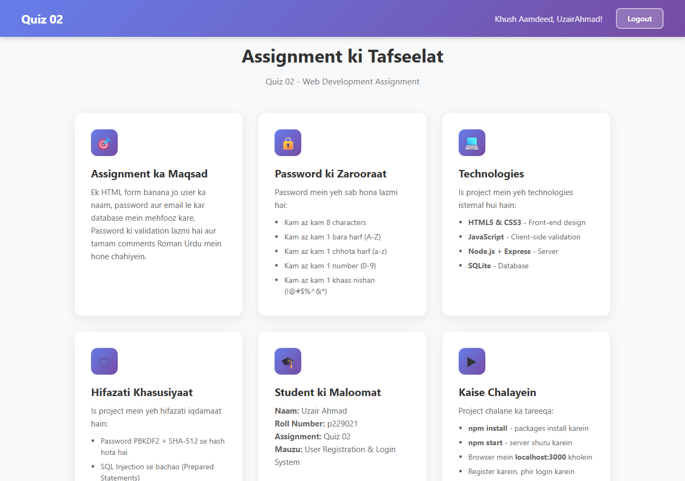

---

## 12. Logout - Login Page Redirect

Jab user logout button dabaye to session khatam ho jata hai aur user wapis login page par aa jata hai. Bina login ke landing page nahi khul sakta.


---

## Mukammal Flow (Complete Flow)

```
Register (/) --> Registration Kamyab --> Login (/login) --> Landing Page (/landing) --> Logout --> Login Page
```

| Qadam | Safha | Kya Hota Hai |
|---|---|---|
| 1 | `/` | User apna naam, email, password darj kare |
| 2 | `/register` | Data tasdeeq ho kar database mein mehfooz ho |
| 3 | `/login` | User email aur password se login kare |
| 4 | `/landing` | Hero section aur assignment details dikhein |
| 5 | `/logout` | Session khatam, wapis login page |
